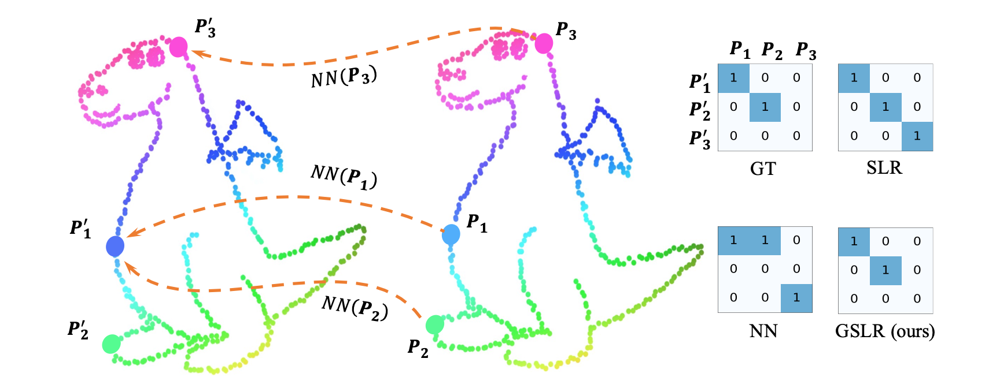

# Generalized-Shuffled-Linear-Regression

#### Code for the ICCV 2021 paper: [Generalized Shuffled Linear Regression](https://drive.google.com/file/d/1Qu21VK5qhCW8WVjiRnnBjehrYVmQrDNh/view?usp=sharing). The supplementary material is [here](https://drive.google.com/file/d/18N1q6Jz3T-dqJA8mJeoylZaEg8eM5Qb0/view).





### 1. Run for demo
##### For image registration and point cloud registration:
* Install necessary dependencies: ```$ pip3 install requirements.txt ```
* Run `img_registration.py` for the image registration demo, and `pcd_registration.py` for the point cloud registration one. 

##### For isometric shape matching:
* Direct to the `shape_matching` folder in Matlab. R2019a or later is needed to use the `matchpairs` function to solve the LAP.
* Run `demo.m` for fun.
* We used the directional operator proposed in the excellent work [BCICP](https://github.com/llorz/SGA18_orientation_BCICP_code), and this code is based on its release. Please pay attention to citation.


### 2. Related topic
The main limitation of our current implementation lies in time efficiency, which is dominated by the LAP solver. 
Some CUDA-based Hungarian algorithms like [this](https://github.com/rapidsai/cugraph) may help to address this problem. 


### 3. Contact
Please feel free to raise an issue or email to [li.feiran@ist.osaka-u.ac.jp](li.feiran@ist.osaka-u.ac.jp) if you have any question regarding the paper or any suggestions for further improvements. 


### 4. Citation
If you find this code helpful, thanks for citing our work as
```
@inproceedings{li2021gslr,
title = {Generalized Shuffled Linear Regression},
author = {Feiran Li and Kent Fujiwara and Fumio Okura and Yasuyuki Matsushita},
booktitle = {IEEE/CVF International Conference on Computer Vision (ICCV)},
year = {2021}
}
